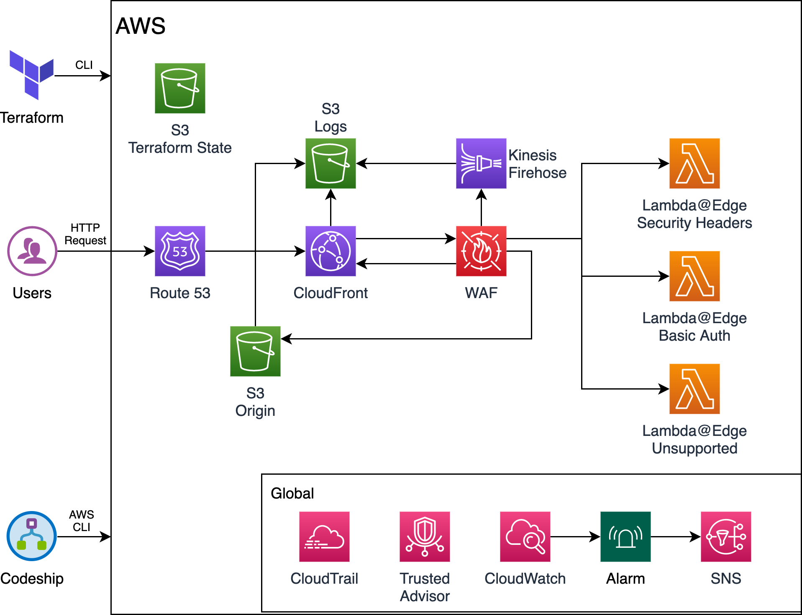

# Devops AWS Single Page Applications

This terraform boilerplate creates a production-ready infrastructure for simple Single Page Applications and can be extended using terraform modules.

It creates a cloudfront distribution using S3 as origin, including out of the box tools as WAF and logs.

---

# Important!

The Terraform configuration found in this repository uses Terraform Cloud which is intended to connect directly to GitHub and plan and execute configurations changes as they are committed. Therefore it is important that this repository is forked or its contents absorbed into the main application repository.

**Recommendation:**\
Create a new Github repository for project's DevOps needs (\*-devops.git) and use Repository template when creating the repo. \
Use [TFenv](https://github.com/tfutils/tfenv) to manage your local Terraform versions.

# Table of Contents

- [Requirements](#requirements)
- [Configuration](#configuration)
- [Setup Codeship CI/CD](#Setup-Codeship-CICD)

# Requirements

You **MUST complete** the below steps before moving on. Contact a Technical Architect or Technical Director on your project or email (`devops@jam3.com`) for assistance with obtaining AWS access.

## 1. AWS Project account with administrative access

You will need an AWS account to host all the infrastructure. You must ask your Technical Architect or Technical Director to create an account and give you access.

## 2. Create AWS user for yourself

As a best practice you should never use the AWS Account root account unless is completely need it.

**Steps:**

- Create IAM group called "Administrator" with admin priviledges.
- Create IAM user with the format "[username]-jam3", assign it to the Administrator group and make sure to:
  - Select a strong password (Between 20 - 30 characters, different characters)
  - Enable MFA
  - Enable Programatic Access (you will need it later)

(Not needed now) [Learn more about AWS IAM Security Best Practice](https://docs.aws.amazon.com/IAM/latest/UserGuide/best-practices.html)

## 3. Create AWS Credentials for Terraform

Terraform requires IAM user credentials with the necessary privileges to perform the provisioning and deprovisioning of AWS resources.

Follow [all these steps to set the credentials](./docs/aws-terraform-credentials.md) manually or you can run `cd scripts/set-aws-script && ./cli.sh`, MAKE SURE you run this command from the project root folder.

## 4. Setup Terraform Cloud workspace

If you are the **only** developer that will use the devops boilerplate, you don't need to use Terraform Cloud. Otherwise follow the steps in [Setup Terraform Cloud workspace](./docs/terraform-cloud-workspace.md) to set terraform manually or you can run `cd scripts/set-terraform-script && ./cli.sh`, MAKE SURE you run this command from the project root folder.

# Configuration

In this guide we will use `myfirstspa` as the project name. Adjust accordingly.

Note that the following code samples assumes a `bash shell` and the `$` denotes the beginning of the command line to help make a distinction between the entered command and the resulting output. It should not be included when executing the command.

## Clone the repository

Clone the forked repository for configuration.

    $ git clone git@github.com:Jam3/<new-spa-devops-repo>.git
    $ cd <new-spa-devops-repo>

## Adjust Terraform Configuration Settings

In this section we will create a `develop` branch and associate it with the `myfirstspa-dev` Terraform Cloud workspace in the `jam3` organization. Repeat this process for each devops environment Terraform Cloud will support.

Create a branch that will be associated with a [Terraform Cloud workspace](./docs/terraform-cloud-workspace.md).

    $ git checkout -b develop

Copy the `settings.auto.tfvars.example` file and provide appropriate values

    $ cp settings.auto.tfvars.example settings.auto.tfvars

Example of `settings.auto.tfvars` values. Adjust accordingly.

    ### General Settings ###
    region      = "us-east-1"
    role_arn    = "arn:aws:iam::152901669089:role/terraformRole"
    name        = "spa"
    namespace   = "jam3"
    environment = "dev"

    ### CloudFront ###
    cloudfront_price_class         = "PriceClass_All"
    cloudfront_wait_for_deployment = false

    ### Notification ###
    alarm_email_address = "michael.silva@jam3.com"

    ### Origin ###
    origin_s3_force_destroy = true

    ### Logging ###
    logs_s3_force_destroy = true

    ### Lambda ###
    lambda_basic_auth_enabled            = true
    lambda_security_headers_enabled      = true
    lambda_security_headers_image_source = []

## Commit and push configured settings

Stage the changes made to the `settings.auto.tfvars` file, commit and push.

    $ git add .
    $ git commit -m 'add: initial devops settings for dev environment'
    $ git push --set-upstream origin develop

## Provision Infrastructure

If your Terraform Cloud workspace has been previously configured and associated with your Single Page Application devops repository, Terraform Cloud may have already begun the process of provisioning the hosting infrastructure on AWS.
However, if the workspace was not set to automatically plan and execute upon repository commit, you may need to `Queue plan` and/or `Confirm` a pending run to start the infrastructure provisioning process.

If a Terraform Cloud workspace has not been setup, proceed with that first before continuing with Codeship CI/CD setup.

Codeship setup will require AWS resource information that is found in the Terraform Cloud run log output.

To obtain the Single Page Application hosting infratructure details,

1. Login and visit the [Jam3 Terraform Cloud workspace page](https://app.terraform.io/app/jam3/workspaces)
2. Select the appropriate workspace
3. Queue Plan and/or Confirm a pending run if necessary, or select the latest Run from the Run list
4. View the run log and note the Terraform output details

# Setup Codeship CI/CD

Next we will be configuring a Codeship project for continuous deployment. It is assumed that the Codeship project is already associated with the Git repository containng the Single Page Application code.

Begin by logging into Codeship, navigating to the appropraite Codeship project `Project Settings` page.

## Codeship Environment Configuration

From the `Project Settings > Environment` section, create the following environment variables:

- `AWS_ACCESS_KEY_ID_DEV` the AWS API access key for the codeship IAM user
- `AWS_SECRET_ACCESS_KEY_DEV` the AWS API secret key for the codeship IAM user
- `S3_DEV` the AWS S3 origin bucket name
- `CF_DEV` the AWS CloudFront distribution ID
- `DOMAIN_DEV` the AWS CloudFront distribution domain name

Create additional environment variables for each Codeship deployment configruation by changing the variable name suffix (`_DEV`)

## Codeship Deploy Configuration

From the `Project Settings > Deploy` section,

1. Click `Add Branch +` and enter the following settings:

- Branch Type: "Branch is exactly"
- Branch Name: "develop"

2. Save the Pipeline Settings

3. Add a `Script` deployment and enter the following Deployment Commands:

```
    # Build
    # npm run build:develop:static # Replace this with the appropriate pre-deployment commands if required

    # Prepare for AWS deploy
    pip install awscli
    export AWS_ACCESS_KEY_ID=${AWS_ACCESS_KEY_ID_DEV}
    export AWS_SECRET_ACCESS_KEY=${AWS_SECRET_ACCESS_KEY_DEV}

    # Update S3 bucket
    aws s3 sync ./out/ s3://${S3_DEV}/ --delete --metadata-directive 'REPLACE' --cache-control max-age=60,public

    # Create empty index.html for en/index.html redirection
    touch index.html
    aws s3 cp index.html s3://${S3_DEV}/index.html --metadata-directive 'REPLACE' --website-redirect "https://${DOMAIN_DEV}/en/" --cache-control max-age=60,public

    # Update CloudFront distribution
    aws cloudfront create-invalidation --distribution-id ${CF_DEV} --paths "/*"
```

4. Save Deployment Settings

Codeship is now set for continuous deployment to the Terraform provisioned hosting infrastructure and **ready to be updated with your custom setup**.

Hint:
For NextJS SPA projects you can use https://app.codeship.com/projects/384142 as template.

# Infrastructure

## Diagram

<p align="center">
    
</p>

## Components

- Route 53
- Cloudfront
- WAF
- Lambda@Edge
- S3
- CloudWatch
- CloudTrail
- Kinesis Firehose (WAF Logs)
- SNS (alarms)
- Trusted Advisor

[Learn more about the components](./docs/infrastructure-components.md)

1. S3 bucket with server enabled

## DevOps File Structure

To be filled
